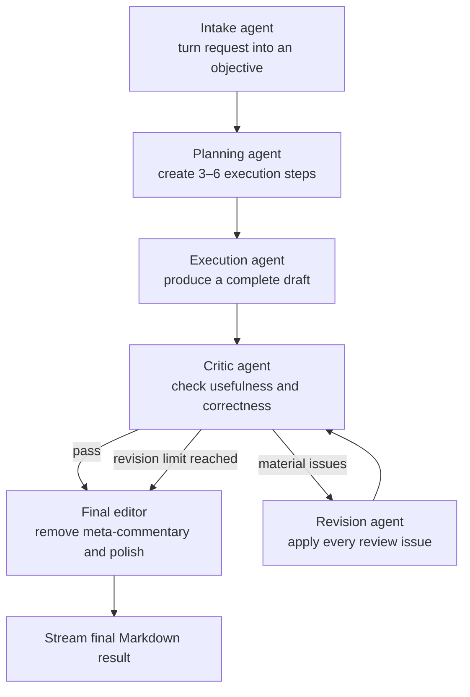
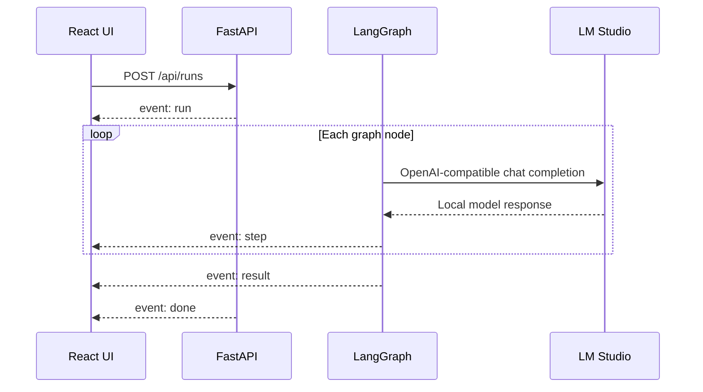

# Local Agent Studio

A local-first agent workspace that turns one request into a deliberate, visible workflow:
understand, plan, execute, critique, optionally revise, and finalize. The language model runs
through [LM Studio](https://lmstudio.ai/) on your machine; the application itself is a FastAPI
API and a responsive React interface.

## Quick start

### 1. Start a model in LM Studio

1. Install and open LM Studio.
2. Download and load a chat/instruct model that fits your machine.
3. Open **Developer**, start the local server, and keep the default
   `http://127.0.0.1:1234` address.

The backend automatically uses the first loaded model. To force a particular model ID, set
`LMSTUDIO_MODEL` in `backend/.env`.

### 2. Install and run

Prerequisites: Python 3.11+, [uv](https://docs.astral.sh/uv/), and Node.js 22+.

```bash
./scripts/setup.sh
./scripts/dev.sh
```

Open [http://127.0.0.1:5173](http://127.0.0.1:5173). The header changes from
**LM Studio offline** to the loaded model ID when the connection is ready.

`setup.sh` creates `backend/.env`, resolves the locked Python environment with uv, and installs
the frontend packages. `dev.sh` runs both development servers and stops both when you press
Ctrl+C.

## What you can run

The UI includes six prompt templates:

| Template | Best for | Result shape |
| --- | --- | --- |
| Write & refine | Announcements, briefs, copy, and explanations | Publication-ready Markdown |
| Analyze | Decisions, documents, situations, and trade-offs | Findings, risks, and recommendation |
| Make a plan | Projects, pilots, migrations, and launches | Phases, milestones, owners, and measures |
| Technical copilot | Design, code review, explanation, and troubleshooting | Precise technical guidance |
| Brainstorm | Product, process, and workflow ideas | Clustered and ranked ideas |
| Summarize | Notes, reports, and source material | Audience-aware decisions and actions |

Add supporting context and one constraint per line when the output needs tighter boundaries.

## Architecture

```mermaid
flowchart LR
    U["Browser user"] -->|REST + streamed events| V["React 19 + Vite 8"]
    V -->|"/api/tasks, /api/health"| F["FastAPI + Uvicorn"]
    V -->|"POST /api/runs (SSE)"| F
    F --> G["LangGraph workflow"]
    G --> C["OpenAI-compatible client"]
    C -->|"localhost:1234/v1"| L["LM Studio local server"]
    L --> M["Loaded local chat model"]

    style V fill:#e7f2eb,stroke:#276f52
    style F fill:#eef4ff,stroke:#46648a
    style G fill:#fff3df,stroke:#b57526
    style L fill:#f0eafa,stroke:#75519c
```



The browser never receives the LM Studio API configuration. It talks only to FastAPI. FastAPI
owns model discovery, prompts, graph state, validation, error normalization, and the streamed
run contract.

## Agent flow



The quality gate is deterministic: the critic returns `pass` or `revise`, and LangGraph chooses
the next edge. `AGENT_MAX_REVISIONS` caps the review loop, preventing an accidental infinite run.
The default is one revision.

## Request lifecycle



Server-Sent Events are used over the streaming `fetch()` response. This keeps the protocol
simple, works through the Vite development proxy, and lets the UI show completed graph stages
without polling.

## Project layout

```text
.
├── backend/
│   ├── app/
│   │   ├── config.py       # Environment-backed settings
│   │   ├── graph.py        # LangGraph nodes, routing, and stream
│   │   ├── llm.py          # LM Studio model discovery and completions
│   │   ├── logging_config.py # JSONL logging, rotation, and correlation context
│   │   ├── main.py         # FastAPI app and SSE endpoint
│   │   ├── models.py       # Validated API and workflow models
│   │   └── templates.py    # Task templates
│   ├── tests/
│   └── pyproject.toml
├── frontend/
│   ├── src/
│   │   ├── App.tsx         # Task console, progress, and result UI
│   │   ├── api.ts          # REST and SSE client
│   │   └── index.css       # Responsive visual system
│   └── package.json
└── scripts/
    ├── setup.sh
    ├── dev.sh
    ├── backend.sh
    └── frontend.sh
```

## Configuration

Edit `backend/.env` after running setup:

| Variable | Default | Purpose |
| --- | --- | --- |
| `LMSTUDIO_BASE_URL` | `http://127.0.0.1:1234/v1` | LM Studio OpenAI-compatible API |
| `LMSTUDIO_API_KEY` | `lm-studio` | Placeholder key expected by the client |
| `LMSTUDIO_MODEL` | empty | Model ID override; empty enables automatic discovery |
| `AGENT_TEMPERATURE` | `0.35` | Default generation temperature |
| `AGENT_MAX_TOKENS` | `1800` | Per-agent response ceiling |
| `AGENT_MAX_REVISIONS` | `1` | Maximum critic/revision loops |
| `CORS_ORIGINS` | local Vite origins | Comma-separated allowed browser origins |
| `LOG_LEVEL` | `DEBUG` | Minimum severity written to the log file |
| `LOG_FILE` | `logs/agentic-flow.log` | Absolute path or path relative to `backend/` |
| `LOG_MAX_BYTES` | `10485760` | Rotate the active log after this many bytes |
| `LOG_BACKUP_COUNT` | `5` | Number of rotated log files to retain |
| `LOG_INCLUDE_CONTENT` | `true` | Include prompts, context, drafts, and answers |

The planning and critic stages use lower temperatures in code so their JSON decisions remain
stable. They also use LM Studio's JSON-schema-constrained structured output, followed by Pydantic
validation. The execution and revision stages use the configured creative temperature.

## Backend logs

The backend writes exhaustive structured logs to `backend/logs/agentic-flow.log`. Each physical
line is one JSON object, making the file readable with ordinary command-line tools and directly
ingestible by systems such as Loki, Elasticsearch, Vector, or Fluent Bit.

The active file rotates automatically at 10 MB. Five backups are retained by default:

```text
backend/logs/agentic-flow.log
backend/logs/agentic-flow.log.1
backend/logs/agentic-flow.log.2
...
```

Follow all events:

```bash
tail -f backend/logs/agentic-flow.log | jq .
```

Follow one run:

```bash
tail -f backend/logs/agentic-flow.log \
  | jq --arg run_id "PASTE-RUN-ID" 'select(.run_id == $run_id)'
```

Show errors with their complete stack traces:

```bash
jq 'select(.level == "ERROR" or .level == "CRITICAL")' \
  backend/logs/agentic-flow.log
```

Summarize local-model latency and token usage:

```bash
jq 'select(.event == "lmstudio.completion.completed")
    | {
        run_id,
        node: .agent_node,
        duration_ms: .details.duration_ms,
        usage: .details.usage
      }' backend/logs/agentic-flow.log
```

Every record includes:

- UTC timestamp, severity, logger name, event name, and message
- request, run, and current agent-node correlation IDs
- process, thread, source file, source line, and function
- event-specific details such as duration, HTTP status, model, routing decision, and token usage
- exception type, message, and full stack trace when an operation fails

The instrumentation covers application startup/shutdown, every HTTP request, task and health
lookups, run acceptance, each emitted SSE event, client disconnects, every LangGraph node and
state update, quality-gate routing, LM Studio discovery and health, completion parameters,
structured-output recovery, response finish reasons, token usage, and final run results.

> **Privacy:** `LOG_INCLUDE_CONTENT=true` records full prompts, context, system instructions,
> intermediate drafts, critiques, and final answers. This is useful for local development and
> debugging but may store sensitive text on disk. Set it to `false` in `backend/.env` for
> metadata-only logs; character counts, timing, routing, token usage, and errors remain available.
> API keys and authorization headers are never logged.

## API

Interactive API documentation is available at
[http://127.0.0.1:8000/docs](http://127.0.0.1:8000/docs).

### `GET /api/health`

Always reports whether the application is alive and separately reports whether LM Studio has a
loaded model.

```json
{
  "status": "ok",
  "lmstudio": "connected",
  "model": "qwen3-8b",
  "detail": null
}
```

### `GET /api/tasks`

Returns the task templates used to construct the frontend cards and starter prompts.

### `POST /api/runs`

```json
{
  "task_id": "plan",
  "prompt": "Create a 30-day pilot plan for a support knowledge assistant.",
  "context": "The support team has 12 people and 4,000 existing articles.",
  "constraints": [
    "Keep customer data local",
    "Include measurable exit criteria"
  ]
}
```

The response content type is `text/event-stream` and emits `run`, `step`, `result`, `error`, then
`done`. Validation failures use normal FastAPI JSON errors before streaming begins.

Try it without the UI:

```bash
curl -N http://127.0.0.1:8000/api/runs \
  -H 'Content-Type: application/json' \
  -d '{
    "task_id": "analyze",
    "prompt": "Compare a local AI assistant with a managed service.",
    "context": "",
    "constraints": ["Use a decision table"]
  }'
```

## Commands

```bash
# Run both servers
./scripts/dev.sh

# Run only one side
./scripts/backend.sh
./scripts/frontend.sh

# Backend tests and lint
uv run --project backend pytest
uv run --project backend ruff check backend

# Frontend typecheck and production build
npm --prefix frontend run typecheck
npm --prefix frontend run build
```

## Design decisions

- **LangGraph rather than a single prompt:** individual stages have narrow responsibilities, the
  quality gate is observable, and revision is bounded.
- **OpenAI-compatible client rather than a cloud SDK integration:** LM Studio exposes the same
  chat-completions shape locally, while model discovery removes a common setup failure.
- **SSE over WebSockets:** runs are server-to-client progress streams after one request; they do
  not need a bidirectional socket protocol.
- **Pydantic at every boundary:** malformed requests, plans, and critiques fail explicitly instead
  of silently corrupting later graph state.
- **Structured, correlated logs:** JSONL events connect an HTTP request to its streamed run,
  individual graph nodes, and LM Studio calls without depending on a hosted observability service.
- **No autonomous tool execution:** task text is untrusted input. The workflow generates answers
  but does not run model-authored shell commands or access arbitrary files.

## Troubleshooting

### The UI says “LM Studio offline”

Open LM Studio, load a chat model, and start the local server. Confirm it directly:

```bash
curl http://127.0.0.1:1234/v1/models
```

If LM Studio uses a different port, update `LMSTUDIO_BASE_URL` and restart the backend.

### A run fails at the planning or review stage

Use an instruction-tuned model with reliable JSON output. Small base models may ignore the
requested schema. The backend strips Markdown code fences and can recover an embedded JSON object,
but it intentionally rejects responses that still cannot be validated.

### Generation is slow

Each run uses at least five local completions. Choose a smaller or more heavily quantized model,
reduce `AGENT_MAX_TOKENS`, or set `AGENT_MAX_REVISIONS=0` during rapid iteration.

### The frontend cannot reach the backend

The Vite proxy expects the API on `127.0.0.1:8000`. If you change `BACKEND_PORT`, also change the
proxy target in `frontend/vite.config.ts`.
