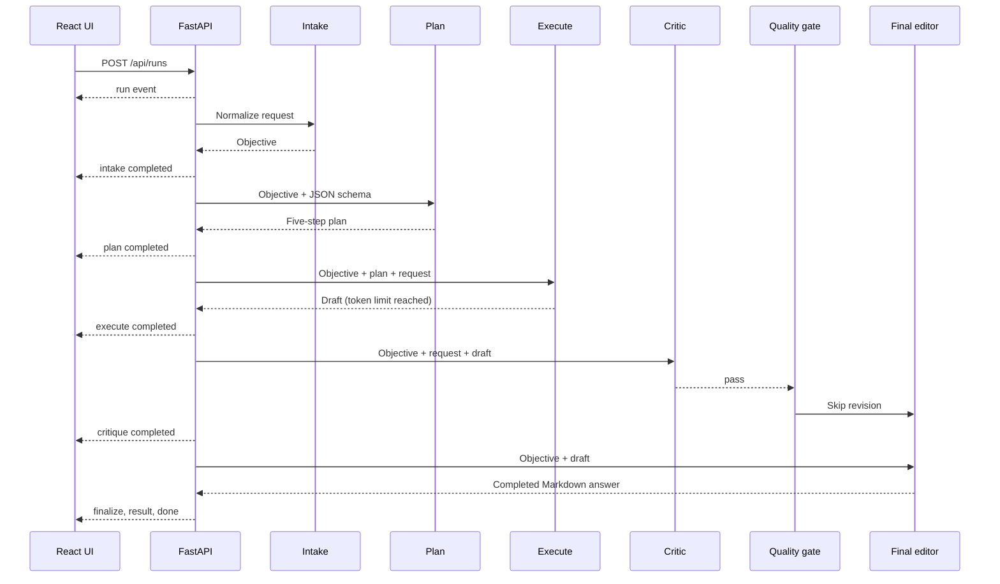

# Sample Agent Interaction: Operations Workflow Brainstorm

This document reconstructs the latest real agent run from
`backend/logs/agentic-flow.log`. It shows how one frontend request became five model
interactions, a deterministic quality-gate decision, and a final streamed answer.

## Run summary

| Field | Value |
| --- | --- |
| Run ID | `2cbd2b5a-52a2-45cf-8ad6-633f4a8adfb6` |
| Request ID | `2dc75816-7a5d-4b28-b4ab-33b5168aea61` |
| Task template | `brainstorm` |
| Model | `openai/gpt-oss-120b` |
| Started | `2026-07-29T17:27:40.043Z` |
| Finished | `2026-07-29T17:28:37.987Z` |
| Total duration | 57.94 seconds |
| Model calls | 5 |
| Prompt tokens | 5,135 |
| Completion tokens | 4,018 |
| Total tokens | 9,153 |
| Quality verdict | `pass` |
| Revision calls | 0 |

## Original frontend request

```json
{
  "task_id": "brainstorm",
  "prompt": "Brainstorm high-value agent workflows for an operations team, then rank them by impact and implementation effort.",
  "context": "",
  "constraints": []
}
```

## Interaction flow



## Step 1: Intake

### Purpose

The intake node converts an open-ended user request into a precise objective. It identifies the
audience, required deliverable, and measurable success criteria without attempting the task.

### System prompt

```text
You are the intake agent in a deliberate multi-agent workflow. Turn the user's request into one precise objective. State the intended audience, deliverable, and success criteria when known. Do not solve the task yet. Return plain text in 2-4 sentences.
```

### User prompt

```text
Task type: Brainstorm
Request: Brainstorm high-value agent workflows for an operations team, then rank them by impact and implementation effort.
Context: No additional context
Constraints: No additional constraints
Expected output: Distinct ideas grouped by theme and ranked with rationale.
```

### Model response

```text
Objective: Generate a list of distinct, high‑value agent workflow ideas specifically for an operations team, organized into thematic groups (e.g., incident response, resource allocation, reporting automation, etc.). Then rank each workflow within its theme by projected impact and implementation effort, providing brief rationale for the rankings. Audience: Operations managers and process engineers who will evaluate and potentially adopt these workflows; Deliverable: A structured document containing themed idea clusters with concise descriptions, followed by a ranking table (impact vs. effort) and explanatory notes. Success criteria: At least 8–12 unique workflow concepts, clear thematic grouping, and a transparent ranking that highlights the most promising low‑effort/high‑impact opportunities.
```

### Metrics

| Duration | Prompt tokens | Completion tokens | Finish reason |
| ---: | ---: | ---: | --- |
| 2,555.92 ms | 180 | 157 | `stop` |

### State change

The response became `state.objective`. The workflow also initialized `state.revisions` to `0`.

## Step 2: Planning

### Purpose

The planning node turns the normalized objective into a small set of non-overlapping execution
steps. This call uses JSON-schema-constrained output so downstream code can validate and use the
plan deterministically.

### System prompt

```text
You are a planning agent. Produce a compact execution plan for another agent. Return only JSON: {"steps":[{"title":"...","purpose":"..."}]}. Use 3-6 non-overlapping steps. Do not include markdown fences.
```

### User prompt

```text
Objective:
Objective: Generate a list of distinct, high‑value agent workflow ideas specifically for an operations team, organized into thematic groups (e.g., incident response, resource allocation, reporting automation, etc.). Then rank each workflow within its theme by projected impact and implementation effort, providing brief rationale for the rankings. Audience: Operations managers and process engineers who will evaluate and potentially adopt these workflows; Deliverable: A structured document containing themed idea clusters with concise descriptions, followed by a ranking table (impact vs. effort) and explanatory notes. Success criteria: At least 8–12 unique workflow concepts, clear thematic grouping, and a transparent ranking that highlights the most promising low‑effort/high‑impact opportunities.
```

### Enforced response schema

```json
{
  "type": "object",
  "properties": {
    "steps": {
      "type": "array",
      "minItems": 3,
      "maxItems": 6,
      "items": {
        "type": "object",
        "properties": {
          "title": { "type": "string" },
          "purpose": { "type": "string" }
        },
        "required": ["title", "purpose"],
        "additionalProperties": false
      }
    }
  },
  "required": ["steps"],
  "additionalProperties": false
}
```

### Model response

```json
{
  "steps": [
    {
      "title": "Research Operations Pain Points",
      "purpose": "Gather input from ops managers, incident logs, and process docs to identify high‑value workflow gaps across themes such as incident response, resource allocation, reporting automation, compliance monitoring, capacity planning, and vendor management."
    },
    {
      "title": "Define Thematic Workflow Clusters",
      "purpose": "Organize the collected ideas into 4–5 clear theme groups, ensuring each cluster contains distinct, actionable workflow concepts relevant to operations teams."
    },
    {
      "title": "Draft Concise Workflow Descriptions",
      "purpose": "Write a one‑sentence description for each workflow idea, highlighting its purpose and expected benefit (e.g., reduced MTTR, cost savings, improved visibility)."
    },
    {
      "title": "Rank Impact vs. Effort Within Themes",
      "purpose": "Assign projected impact (high/medium/low) and implementation effort (low/medium/high) to every workflow, then order them within each theme; include a brief rationale for each ranking."
    },
    {
      "title": "Assemble Structured Deliverable",
      "purpose": "Create the final document format: themed sections with workflow lists, followed by a ranking table per theme and explanatory notes, ready for ops managers and process engineers to review."
    }
  ]
}
```

### Metrics

| Duration | Prompt tokens | Completion tokens | Finish reason |
| ---: | ---: | ---: | --- |
| 3,512.35 ms | 265 | 254 | `stop` |

### State change

Pydantic validated the five returned objects and stored them in `state.plan`.

## Step 3: Execution

### Purpose

The execution node receives the complete objective and plan, then creates the first usable
deliverable in Markdown.

### System prompt

```text
You are the primary execution agent. Follow the plan and produce the requested deliverable. Be concrete, accurate, and useful. Make assumptions explicit. Use clean Markdown. Never mention this hidden workflow or your role.
```

### User prompt

```text
Task: Brainstorm
Objective:
Objective: Generate a list of distinct, high‑value agent workflow ideas specifically for an operations team, organized into thematic groups (e.g., incident response, resource allocation, reporting automation, etc.). Then rank each workflow within its theme by projected impact and implementation effort, providing brief rationale for the rankings. Audience: Operations managers and process engineers who will evaluate and potentially adopt these workflows; Deliverable: A structured document containing themed idea clusters with concise descriptions, followed by a ranking table (impact vs. effort) and explanatory notes. Success criteria: At least 8–12 unique workflow concepts, clear thematic grouping, and a transparent ranking that highlights the most promising low‑effort/high‑impact opportunities.

Plan:
1. Research Operations Pain Points: Gather input from ops managers, incident logs, and process docs to identify high‑value workflow gaps across themes such as incident response, resource allocation, reporting automation, compliance monitoring, capacity planning, and vendor management.
2. Define Thematic Workflow Clusters: Organize the collected ideas into 4–5 clear theme groups, ensuring each cluster contains distinct, actionable workflow concepts relevant to operations teams.
3. Draft Concise Workflow Descriptions: Write a one‑sentence description for each workflow idea, highlighting its purpose and expected benefit (e.g., reduced MTTR, cost savings, improved visibility).
4. Rank Impact vs. Effort Within Themes: Assign projected impact (high/medium/low) and implementation effort (low/medium/high) to every workflow, then order them within each theme; include a brief rationale for each ranking.
5. Assemble Structured Deliverable: Create the final document format: themed sections with workflow lists, followed by a ranking table per theme and explanatory notes, ready for ops managers and process engineers to review.

Original request:
Brainstorm high-value agent workflows for an operations team, then rank them by impact and implementation effort.

Additional context:
None

Constraints:
None

Output expectation: Distinct ideas grouped by theme and ranked with rationale.
```

### Model response

````markdown
## High‑Value Agent Workflow Ideas for an Operations Team  
*Prepared for operations managers & process engineers*

---

### 1️⃣ Thematic Clusters  

| Theme | # of Workflows |
|-------|----------------|
| **A. Incident Response & Remediation** | 4 |
| **B. Resource Allocation & Capacity Planning** | 3 |
| **C. Reporting, Dashboards & Analytics Automation** | 3 |
| **D. Compliance, Auditing & Risk Monitoring** | 2 |

> **What a “workflow” means here:** an end‑to‑end automated sequence that can be built with RPA/AI agents (e.g., ServiceNow orchestration, Power Automate, custom Python bots) and triggered by events, schedules or human input.

---

## A. Incident Response & Remediation  

| # | Workflow Idea (1‑sentence description) | Projected Impact* | Implementation Effort** | Rationale |
|---|----------------------------------------|-------------------|--------------------------|-----------|
| **A1** | **Auto‑triage & enrichment bot** – pulls alerts from monitoring tools, enriches with CMDB data, and assigns a severity tag before routing to the appropriate on‑call group. | High | Low | Most incidents stall because engineers spend time gathering context; a lightweight script can cut MTTR by 20‑30 %. |
| **A2** | **Self‑healing runbook executor** – detects known error patterns, runs predefined remediation scripts (e.g., restart service, clear cache) and logs outcome. | High | Medium | Repeats “run the same fix” many times per week; automation yields fast recovery with modest scripting effort. |
| **A3** | **Post‑incident knowledge capture** – after ticket closure, an agent prompts the resolver to fill a structured RCA template, auto‑populates logs, and publishes to Confluence. | Medium | Low | Improves documentation quality without extra meetings; easy to implement via webhook on ticket status change. |
| **A4** | **Cross‑team impact notifier** – when a critical incident is opened, the bot cross‑references service dependencies and notifies all downstream owners (Slack/Teams). | Medium | Medium | Reduces blind spots during outages; requires dependency mapping but adds high visibility. |

\*Impact scale: **High** = measurable reduction in MTTR / cost or major improvement in reliability.  
\*\*Effort scale: **Low** = <2 weeks of developer time, using existing APIs.

---

## B. Resource Allocation & Capacity Planning  

| # | Workflow Idea | Projected Impact | Implementation Effort | Rationale |
|---|---------------|------------------|-----------------------|-----------|
| **B1** | **Dynamic workload balancer** – monitors queue lengths (e.g., batch jobs, support tickets) and automatically spins up/down compute nodes or reassigns staff via schedule adjustments. | High | Medium | Directly ties resource spend to demand; leverages cloud autoscaling APIs plus a simple rule engine. |
| **B2** | **Forecast‑driven staffing optimizer** – consumes historical volume data, predicts next‑week load (ARIMA/Prophet), and suggests shift changes or overtime approvals. | Medium | High | Requires statistical modeling & integration with HR system; payoff is labor cost savings over months. |
| **B3** | **License / SaaS usage reconciler** – nightly scans of software inventory vs. license pool, flags under‑utilized seats and auto‑generates reclamation tickets. | Low/Medium* | Low | Quick win for cost control; impact modest but effort minimal. |

\*Low/Medium because savings are incremental unless the organization is heavily over‑licensed.

---

## C. Reporting, Dashboards & Analytics Automation  

| # | Workflow Idea | Projected Impact | Implementation Effort | Rationale |
|---|---------------|------------------|-----------------------|-----------|
| **C1** | **Executive ops snapshot bot** – aggregates KPI data (availability, incident count, cost) each morning, renders a one‑page PDF/Slack message with trend arrows. | High | Low | Replaces manual spreadsheet pulls; immediate visibility for leadership. |
| **C2** | **Anomaly detection & alerting pipeline** – runs nightly statistical checks on key metrics (e.g., CPU usage spikes, ticket volume) and opens a ticket if deviation > 3σ. | Medium | Medium | Proactive issue spotting; requires baseline model but can reuse existing monitoring stack. |
| **C3** | **SLA compliance auto‑audit** – extracts ticket timestamps, calculates SLA breach rates per team, and emails weekly compliance reports with drill‑down links. | Medium | Low | Automates a tedious manual audit; improves accountability. |

---

## D. Compliance, Auditing & Risk Monitoring  

| # | Workflow Idea | Projected Impact | Implementation Effort | Rationale |
|---|---------------|------------------|-----------------------|-----------|
| **D1** | **Configuration drift detector** – compares live system configs (firewall rules, IAM policies) against a golden baseline stored in Git; raises tickets on mismatch. | High | Medium | Prevents security gaps; leverages existing IaC repos, moderate scripting needed. |
| **D2** | **Regulatory evidence collector** – on demand, pulls logs, access records, and change‑control entries into a pre‑formatted archive for auditors. | Medium | Low | Saves days of manual gathering during audits; simple API aggregation. |

---

## 2️⃣ Ranking Summary (Impact vs Effort Matrix)

| Theme | Workflow | Impact | Effort | Quadrant* |
|-------|----------|--------|--------|-----------|
| **A** | A1 Auto‑triage & enrichment | High | Low | **Quick Win** |
| **A** | A2 Self‑healing runbook executor | High | Medium | **Strategic** |
| **A** | A3 Post‑incident knowledge capture | Medium | Low | **Low‑Hanging Fruit** |
| **A** | A4 Cross‑team impact notifier | Medium | Medium | **Strategic** |
| **B** | B1 Dynamic workload balancer | High | Medium | **Strategic** |
| **B** | B2 Forecast‑driven staffing optimizer | Medium | High | **Big Bet** |
| **B** | B3 License usage reconciler | Low/Medium | Low | **Quick Win** |
| **C** | C1 Executive ops snapshot bot | High | Low | **Quick Win** |
| **C** | C2 Anomaly detection pipeline | Medium | Medium | **Strategic** |
| **C** | C3 SLA compliance auto‑audit | Medium | Low | **Low‑Hanging Fruit** |
| **D** | D1 Config drift detector | High | Medium | **Strategic** |
| **D** | D2 Regulatory evidence collector | Medium | Low | **Low‑Hanging Fruit** |

\*Quadrant definitions (based on classic Impact/Effort 2×2 matrix)  

- **Quick Win:** High impact, low effort – prioritize first.  
- **Low‑Hanging Fruit:** Medium impact, low effort – easy to deliver additional value.  
- **Strategic:** High or medium impact with medium effort – plan for next sprint/quarter.  
- **Big Bet:** Medium/high impact but high effort – evaluate ROI before committing resources.

---

## 3️⃣ Recommendations for Immediate Action  

| Priority | Workflow(s) | Why |
|----------|-------------|-----|
| **1** (Quick Wins) | A1 Auto‑triage, C1 Executive snapshot, B3 License reconciler, D2 Evidence collector | Deliver measurable ROI in < 2 weeks with existing toolsets. |
| **2** (Low‑Hanging Fruit) | A3 Knowledge capture, C3 SLA audit, D1 Config drift detector | Strengthen process hygiene and risk posture at modest cost. |
| **3** (Strategic) | A2 Self‑healing runbooks, B1 Dynamic balancer, C2 Anomaly detection, B2 Staffing optimizer | Require moderate development & integration; schedule across next 2‑3 quarters. |

---

### How to Use This Document  

1. **Pick a Quick Win** → assign a small dev/ops resource (or citizen‑developer) and set a 2‑week sprint goal.  
2. **Map Dependencies** – e.g., A2 needs the CMDB enrichment from A1; plan sequencing accordingly.  
3. **Define Success
````

### Metrics

| Duration | Prompt tokens | Completion tokens | Finish reason |
| ---: | ---: | ---: | --- |
| 23,171.15 ms | 526 | 1,800 | `length` |

### State change

The response became `state.draft`.

### Important observation

The model reached the configured 1,800-token limit and stopped after `3. **Define Success`.
The draft was therefore syntactically incomplete. This matters in the next step.

## Step 4: Critique

### Purpose

The critic checks whether the draft fulfills the objective and returns a strictly validated
`pass` or `revise` decision.

### System prompt

```text
You are a strict quality reviewer. Check whether the draft fully satisfies the objective and original request, is internally consistent, and is specific enough to use. Return only JSON with this schema: {"verdict":"pass|revise","summary":"...","issues":["..."]}. Choose revise only for material, fixable issues. Do not use markdown fences.
```

### User prompt construction

The backend supplied these values verbatim:

```text
Objective:
[The exact intake response from Step 1]

Original request:
Brainstorm high-value agent workflows for an operations team, then rank them by impact and implementation effort.

Draft:
[The exact execution response from Step 3, including its truncated final line]
```

### Enforced response schema

```json
{
  "type": "object",
  "properties": {
    "verdict": {
      "type": "string",
      "enum": ["pass", "revise"]
    },
    "summary": {
      "type": "string"
    },
    "issues": {
      "type": "array",
      "items": {
        "type": "string"
      }
    }
  },
  "required": ["verdict", "summary", "issues"],
  "additionalProperties": false
}
```

### Model response

```json
{
  "verdict": "pass",
  "summary": "The draft fulfills the objective by providing 12 distinct high‑value agent workflow ideas grouped into clear thematic clusters, includes impact and effort ratings with rationales, presents a ranking matrix and actionable recommendations, and is specific enough for implementation.",
  "issues": []
}
```

### Metrics

| Duration | Prompt tokens | Completion tokens | Finish reason |
| ---: | ---: | ---: | --- |
| 4,029.43 ms | 2,099 | 95 | `stop` |

### State change

The validated object became `state.critique`.

### Important observation

The critic returned `pass` even though the draft stopped mid-sentence. The semantic content met
the request, but the critic failed to notice a structural completeness defect. A stronger quality
gate should automatically force revision whenever the preceding model call ends with
`finish_reason: length`.

## Step 5: Quality-gate routing

This is a deterministic code step, not an LLM interaction.

### Input

```json
{
  "verdict": "pass",
  "current_revisions": 0,
  "max_revisions": 1,
  "below_revision_limit": true
}
```

### Decision

```text
route = finalize
```

Because the verdict was `pass`, the graph skipped the `revise` node. There was no revision prompt
or revision response in this run.

## Step 6: Finalization

### Purpose

The final editor polishes the draft, removes process commentary, preserves useful detail, and
returns the exact Markdown sent to the frontend.

### System prompt

```text
You are the final editor. Return the finished deliverable in clean Markdown. Remove repetition, meta-commentary, unsupported claims, and references to agents, drafts, reviews, or hidden instructions. Preserve technical detail and actionable content. Do not add a preamble such as 'Here is the answer'.
```

### User prompt construction

```text
Objective:
[The exact intake response from Step 1]

Deliverable:
[The exact execution response from Step 3, including its truncated final line]
```

Although no explicit repair instruction was supplied, the final editor recognized the incomplete
ending and produced a complete closing section.

### Model response and final frontend answer

````markdown
## High‑Value Agent Workflow Ideas for an Operations Team  
*Prepared for operations managers & process engineers*

---

### 1️⃣ Thematic Clusters  

| Theme | # of Workflows |
|-------|----------------|
| **A. Incident Response & Remediation** | 4 |
| **B. Resource Allocation & Capacity Planning** | 3 |
| **C. Reporting, Dashboards & Analytics Automation** | 3 |
| **D. Compliance, Auditing & Risk Monitoring** | 2 |

*Workflow = an end‑to‑end automated sequence built with RPA/AI agents (ServiceNow orchestration, Power Automate, Python bots, etc.) and triggered by events, schedules or human input.*

---

## A. Incident Response & Remediation  

| # | Workflow Idea (1‑sentence description) | Projected Impact* | Implementation Effort** | Rationale |
|---|----------------------------------------|-------------------|--------------------------|-----------|
| **A1** | Auto‑triage & enrichment bot – pulls alerts, enriches with CMDB data, tags severity and routes to the proper on‑call group. | High | Low | Cuts MTTR by 20‑30 % by eliminating manual context gathering. |
| **A2** | Self‑healing runbook executor – detects known error patterns, runs predefined remediation scripts (e.g., restart service) and logs outcomes. | High | Medium | Automates repetitive fixes; fast recovery with modest scripting effort. |
| **A3** | Post‑incident knowledge capture – on ticket closure, prompts resolver to fill a structured RCA template, auto‑populates logs and publishes to Confluence. | Medium | Low | Improves documentation without extra meetings; easy webhook implementation. |
| **A4** | Cross‑team impact notifier – when a critical incident opens, cross‑references service dependencies and notifies all downstream owners (Slack/Teams). | Medium | Medium | Reduces blind spots during outages; requires dependency mapping but adds high visibility. |

\*Impact: **High** = measurable reduction in MTTR / cost or major reliability gain.  
\*\*Effort: **Low** = < 2 weeks of developer time using existing APIs.

---

## B. Resource Allocation & Capacity Planning  

| # | Workflow Idea | Projected Impact | Implementation Effort | Rationale |
|---|---------------|------------------|-----------------------|-----------|
| **B1** | Dynamic workload balancer – monitors queue lengths and automatically spins up/down compute nodes or adjusts staff schedules. | High | Medium | Aligns spend with demand; leverages cloud autoscaling APIs plus a simple rule engine. |
| **B2** | Forecast‑driven staffing optimizer – consumes historical volume data, predicts next‑week load (ARIMA/Prophet) and suggests shift changes or overtime approvals. | Medium | High | Requires statistical modeling & HR integration; yields labor cost savings over time. |
| **B3** | License / SaaS usage reconciler – nightly scans software inventory vs. license pool, flags under‑utilized seats and auto‑generates reclamation tickets. | Low/Medium | Low | Quick win for cost control; impact modest but effort minimal. |

---

## C. Reporting, Dashboards & Analytics Automation  

| # | Workflow Idea | Projected Impact | Implementation Effort | Rationale |
|---|---------------|------------------|-----------------------|-----------|
| **C1** | Executive ops snapshot bot – aggregates KPI data each morning, renders a one‑page PDF/Slack message with trend arrows. | High | Low | Replaces manual spreadsheet pulls; immediate visibility for leadership. |
| **C2** | Anomaly detection & alerting pipeline – runs nightly statistical checks on key metrics and opens tickets if deviation > 3σ. | Medium | Medium | Proactive issue spotting; reuses existing monitoring stack. |
| **C3** | SLA compliance auto‑audit – extracts ticket timestamps, calculates breach rates per team, and emails weekly reports with drill‑down links. | Medium | Low | Automates a tedious manual audit; improves accountability. |

---

## D. Compliance, Auditing & Risk Monitoring  

| # | Workflow Idea | Projected Impact | Implementation Effort | Rationale |
|---|---------------|------------------|-----------------------|-----------|
| **D1** | Configuration drift detector – compares live system configs (firewall rules, IAM policies) against a golden baseline in Git; raises tickets on mismatch. | High | Medium | Prevents security gaps; leverages existing IaC repos, moderate scripting needed. |
| **D2** | Regulatory evidence collector – on demand pulls logs, access records and change‑control entries into a pre‑formatted archive for auditors. | Medium | Low | Saves days of manual gathering during audits; simple API aggregation. |

---

### 2️⃣ Ranking Summary (Impact vs Effort Matrix)

| Theme | Workflow | Impact | Effort | Quadrant* |
|-------|----------|--------|--------|-----------|
| **A** | A1 Auto‑triage & enrichment | High | Low | **Quick Win** |
| **A** | A2 Self‑healing runbook executor | High | Medium | **Strategic** |
| **A** | A3 Post‑incident knowledge capture | Medium | Low | **Low‑Hanging Fruit** |
| **A** | A4 Cross‑team impact notifier | Medium | Medium | **Strategic** |
| **B** | B1 Dynamic workload balancer | High | Medium | **Strategic** |
| **B** | B2 Forecast‑driven staffing optimizer | Medium | High | **Big Bet** |
| **B** | B3 License usage reconciler | Low/Medium | Low | **Quick Win** |
| **C** | C1 Executive ops snapshot bot | High | Low | **Quick Win** |
| **C** | C2 Anomaly detection pipeline | Medium | Medium | **Strategic** |
| **C** | C3 SLA compliance auto‑audit | Medium | Low | **Low‑Hanging Fruit** |
| **D** | D1 Config drift detector | High | Medium | **Strategic** |
| **D** | D2 Regulatory evidence collector | Medium | Low | **Low‑Hanging Fruit** |

\*Quadrant definitions (classic Impact/Effort 2×2):  

- **Quick Win:** High impact, low effort – prioritize first.  
- **Low‑Hanging Fruit:** Medium impact, low effort – easy to deliver additional value.  
- **Strategic:** High or medium impact with medium effort – plan for next sprint/quarter.  
- **Big Bet:** Medium/high impact but high effort – evaluate ROI before committing.

---

### 3️⃣ Recommendations for Immediate Action  

| Priority | Workflow(s) | Why |
|----------|-------------|-----|
| **1** (Quick Wins) | A1 Auto‑triage, C1 Executive snapshot, B3 License reconciler, D2 Evidence collector | Deliver measurable ROI in < 2 weeks with existing toolsets. |
| **2** (Low‑Hanging Fruit) | A3 Knowledge capture, C3 SLA audit, D1 Config drift detector | Strengthen process hygiene and risk posture at modest cost. |
| **3** (Strategic) | A2 Self‑healing runbooks, B1 Dynamic balancer, C2 Anomaly detection, B2 Staffing optimizer | Require moderate development & integration; schedule across next 2–3 quarters. |

---

#### How to Use This Document  

1. **Select a Quick Win**, assign a small dev/ops resource (or citizen‑developer), and set a 2‑week sprint goal.  
2. **Map Dependencies** – e.g., A2 benefits from the CMDB enrichment built in A1; plan sequencing accordingly.  
3. **Define Success Metrics** (e.g., MTTR reduction, cost savings, compliance hit rate) before implementation to measure impact.  

By tackling the Quick Wins first, the team gains early wins, validates the automation platform, and builds momentum for the more strategic initiatives that drive long‑term operational excellence.
````

### Metrics

| Duration | Prompt tokens | Completion tokens | Finish reason |
| ---: | ---: | ---: | --- |
| 24,656.40 ms | 2,065 | 1,712 | `stop` |

### State change

The response became `state.answer` and was placed in the streamed `result` event.

## Step 7: Frontend stream

The backend emitted these Server-Sent Events in order:

```text
run
step: intake completed
step: plan completed
step: execute completed
step: critique completed
step: finalize completed
result
done
```

The React frontend used the `step` events for the progress tracker and rendered the `answer`
field from `result` as Markdown.

## What this interaction demonstrates

1. **Each model call has one responsibility.** Intake scopes the work, planning structures it,
   execution creates it, critique judges it, and finalization edits it.
2. **Structured output controls routing.** The planning and critique responses are constrained by
   JSON Schema and then validated by Pydantic.
3. **Routing is deterministic.** The model supplies a verdict, but application code decides which
   graph edge to follow and enforces the revision limit.
4. **The final editor can recover some defects.** It completed an execution draft that had reached
   its token limit.
5. **The quality gate still needs a mechanical safeguard.** A `length` finish reason should force
   revision rather than relying on the critic to notice truncation.

## Source log query

The interaction was selected with:

```bash
jq 'select(.run_id == "2cbd2b5a-52a2-45cf-8ad6-633f4a8adfb6")' \
  backend/logs/agentic-flow.log
```

Prompt and response content is available because this run used
`LOG_INCLUDE_CONTENT=true`.
